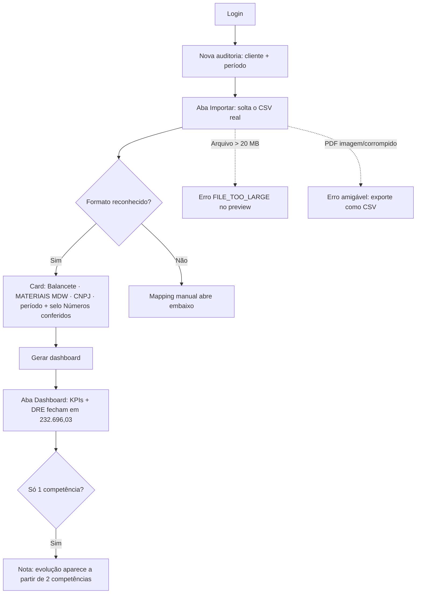
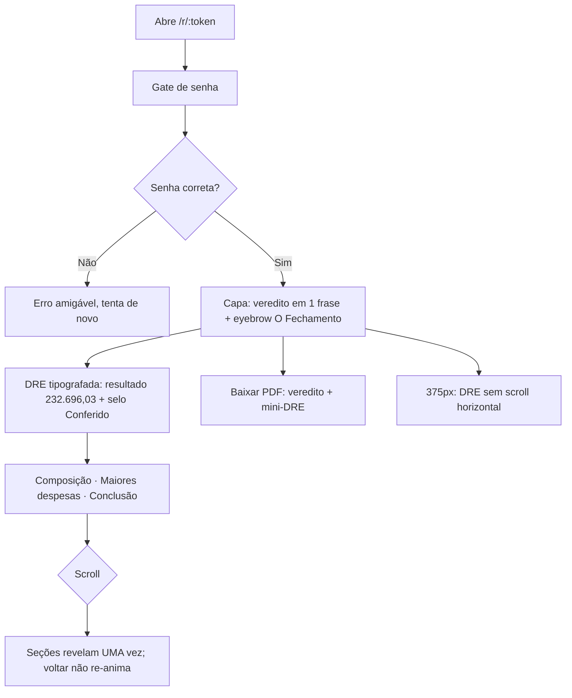

# Dogfood Report — claude/auditcontabil-platform-dev-ae858e

> Diff-scoped browser QA of `claude/auditcontabil-platform-dev-ae858e` vs the trunk. Generated by `/ce-dogfood` on 2026-07-12.

## Diff Summary

- **Motor de extração dos arquivos reais** (`src/workers/extractors/`): balancete CSV CP1252 + DRE em PDF (pdfjs), reconciliação ao centavo, classificação por código contábil.
- **Import zero-clique** (`src/features/audits/import/import-page.tsx`): detecção automática de formato, card falante (empresa/CNPJ/período/selo de conferência), aceita `.pdf`.
- **Deck "O Fechamento"** (`src/features/share/components/public-report.tsx` + `deck/` + `analytics/charts/` + `insights.ts`/`statement.ts`): capa com veredito, DRE tipografada com Fraunces + selo, insights por seção, reveal-once no scroll.
- **Dashboard interno** degrada honesto (nota quando só há 1 competência).
- **PDF de saída** alinhado à narrativa (veredito + mini-DRE + hex de contraste).
- **Fixes do /ce-code-review**: preview respeita 20 MB; pdf-loader em try/finally.
- Migration 7 (classificação por código + R001/R002 cientes de doc extraído) — aplicada em prod pelo usuário nesta sessão.

## Personas

Fonte: inferidas (sem STRATEGY.md; derivadas do PRD e do uso real da sessão).

- **Janaina (contadora, CRC-PB)** — sobe o arquivo que a plataforma dela já exporta e precisa CONFIAR nos números; zero paciência para mapear colunas; o produto erra um centavo = perde a confiança.
- **Cliente leigo (dono da empresa)** — recebe o link com senha; quer entender em 1 minuto se fechou no azul, sem jargão contábil, no celular.

## Flows Tested

### F1 — Janaina importa o balancete real e gera o dashboard

### F2 — Cliente abre o deck "O Fechamento"

## Test Matrix & Results

| # | Flow | Journey / Scenario | Status | Issue | Fix | Commit |
|---|------|--------------------|--------|-------|-----|--------|
| 1 | F1 | Login + home logada (onboarding renderiza) | Pass | - | - | - |
| 2 | F1 | Upload balancete-mdw-2025.csv → card detectado correto + selo | Pass | - | - | - |
| 3 | F1 | Gerar dashboard → números fecham + nota 1 competência | Pass | - | - | - |
| 4 | F1 | Upload dre-educacao-2024.pdf → card detectado (lucro 1.346.640,06) | Fixed | summarizeDre classificava PDF por código (inexistente) → DIVERGÊNCIA falsa de -20 mi | classificação por ancestralidade quando meta.kind=dre-pdf | 322885f |
| 5 | F1 | Arquivo >20 MB → erro FILE_TOO_LARGE no preview (fix #1 do review) | Pass | - | - | - |
| 6 | F1 | PDF sem texto → erro amigável "exporte como CSV" | Fixed | catch do preview engolia a mensagem específica ("abre no Excel" p/ PDF) | mensagem curada do worker chega ao usuário | 322885f |
| 7 | F2 | Deck happy path: gate → veredito → DRE 232.696,03 + selo; seções de empresa/evolução ocultas | Pass | - | - | - |
| 8 | F2 | Reveal-once: rolar até o fim revela tudo; voltar não re-anima | Pass | - | - | - |
| 9 | F2 | 375px: DRE sem scroll horizontal; capa legível | Fixed | tabela sr-only vazava 570px (table ignora width:1px) | sr-only movido p/ div wrapper + teste de regressão | 9ac65fa |
| 10 | F2 | Senha errada → erro amigável | Pass | - | - | - |
| 11 | F2 | Baixar PDF: botão responde (download real = verificação humana) | Blocked (needs human verify) | geração ok sem toast de erro; conteúdo do arquivo = humano | - | - |

Status values: `Pending`, `Pass`, `Fixed`, `Skipped`, `Blocked (needs human verify)`, `Blocked (human decision)`.

## What Was Fixed

### summarizeDre acusava DIVERGÊNCIA falsa em PDF — `322885f`
- **Symptom:** card do import dizia "resultado calculado (-R$ 20.317.316,03) difere do declarado" para a DRE real em PDF; o selo de reconciliação também marcaria invalid.
- **Root cause:** `summarizeDre` classificava por CÓDIGO de conta (PDF não tem código) e caía no fallback por nome, errando a conta inteira. O teste de aceitação somava por `classifyPdfRow` direto e nunca exercitou `summarizeDre` com PDF.
- **Fix:** `src/workers/extractors/dre-summary.ts` — branch por `meta.kind`: PDF classifica pela ancestralidade (`classifyPdfRow`).
- **Regression test:** `dre-pdf.test.ts` — `summarizeDre` no PDF real tem que conciliar em 1.346.640,06.

### Tabela sr-only criava scroll horizontal fantasma em 375px — `9ac65fa`
- **Symptom:** deck em viewport mobile rolava horizontal (610px de conteúdo em 375px).
- **Root cause:** table layout trata `width:1px` como MÍNIMO; a `<table class="sr-only">` (equivalente textual) media 570px invisíveis.
- **Fix:** `charts/top-accounts.tsx` + `charts/period-trend.tsx` — sr-only movido para um `
` wrapper.
- **Regression test:** `charts/sr-only-tables.test.tsx` mede o box real (≤ 8px) com a CSS do app carregada.

### Erro genérico para PDF escaneado — `322885f`
- **Symptom:** PDF sem texto mostrava "verifique se ele abre no Excel" (conselho errado para PDF).
- **Root cause:** o catch do preview descartava a mensagem curada do worker.
- **Fix:** `import-page.tsx` — mensagem específica de PDF chega ao usuário.
- **Regression test:** browser-replay (fix de copy/roteamento de mensagem; o throw específico do worker já é garantido pelo caminho de extração testado). Reverificado no agent-browser: a copy correta aparece.

## Paper Cuts (by persona)

- **Cliente leigo** — rodapé/eyebrow do deck mostra "Escritório Piloto" (mojibake gravado no banco em seed antiga; snapshots são congelados, então persiste nos decks já publicados) — moderado — deferred (1 UPDATE no SQL Editor + republicar; correção automática foi bloqueada pelo classificador).
- **Cliente leigo** — pulo instantâneo (tecla End/arrastar scrollbar) pode passar por cima de uma seção sem revelá-la; ela revela na primeira passada normal de scroll (comportamento padrão de IntersectionObserver) — leve — deferred (não fere uso real; monitorar).
- **Janaina** — depois de "Gerar dashboard", o botão "Ver o dashboard" aparece enquanto "Guardando o arquivo original" ainda roda; clicar cedo funciona, mas a sobreposição de estados pode confundir — leve — deferred.

## Console Errors

Nenhum erro de console em nenhum cenário (verificado via `agent-browser errors` após cada fluxo). Apenas logs de dev (vite/React DevTools).

## Human Verifications

- Download real do PDF do deck (chrome headless baixa para disco — confirmar conteúdo manualmente se necessário).

## Decisions for a Human

### Nome do escritório com mojibake no banco
- **What's broken:** `escritorios.name` = "Escritório Piloto" (double-encoding em seed antiga); aparece no cabeçalho e rodapé de todos os decks.
- **Why escalated:** UPDATE em dado compartilhado de produção foi bloqueado pelo classificador de permissões; snapshots publicados são imutáveis (a correção só vale para publicações futuras).
- **Options:** (a) rodar `update escritorios set name = 'Escritório Piloto';` no SQL Editor e republicar os decks demo; (b) ignorar até o onboarding real (a conta piloto será renomeada de qualquer jeito).
- **Recommendation:** opção (a) — 10 segundos, remove o único defeito visual do deck demo.

## Learnings

- **Table layout ignora width:1px** — `sr-only` direto numa `<table>` não colapsa; sempre embrulhar em `div.sr-only`. Vale para qualquer equivalente textual de gráfico.
- **Teste de aceitação tem que exercitar o CAMINHO DE PRODUÇÃO, não a lógica equivalente**: o teste do PDF somava via `classifyPdfRow` (correto) enquanto o produto usava `summarizeDre` (errado). A regressão agora chama exatamente a função que o card e o selo usam.
- **agent-browser no Windows**: paths POSIX do git-bash (`/c/Users/...`) falham silenciosamente no `upload` (reporta ✓ mas `input.files` fica vazio) — usar path nativo `C:\...`. Sempre conferir `input.files.length` após upload.

## Final Status

**Pronta para merge.** 11 cenários: 7 Pass, 3 Fixed (commits 9ac65fa, 322885f), 1 Blocked (needs human verify — conteúdo do PDF baixado). Suíte completa: **147/147 testes verdes**, tsc/knip limpos, eslint só com 1 warning pré-existente fora do diff. Migração 7 confirmada viva em produção (R001/R002 = "Não executada" honesta, zero falsos alarmes na auditoria nova). Os commits do dogfood ainda não foram pushados — o push atualiza a PR #5.
