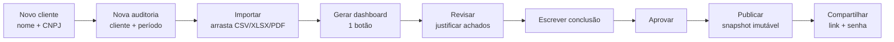
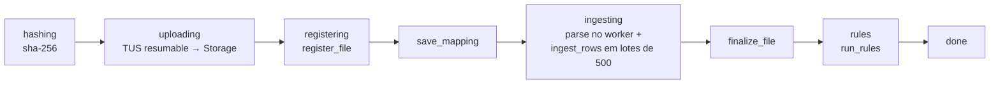
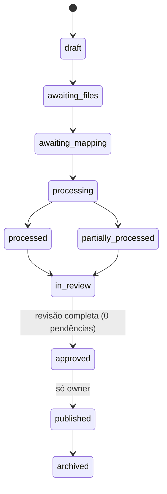
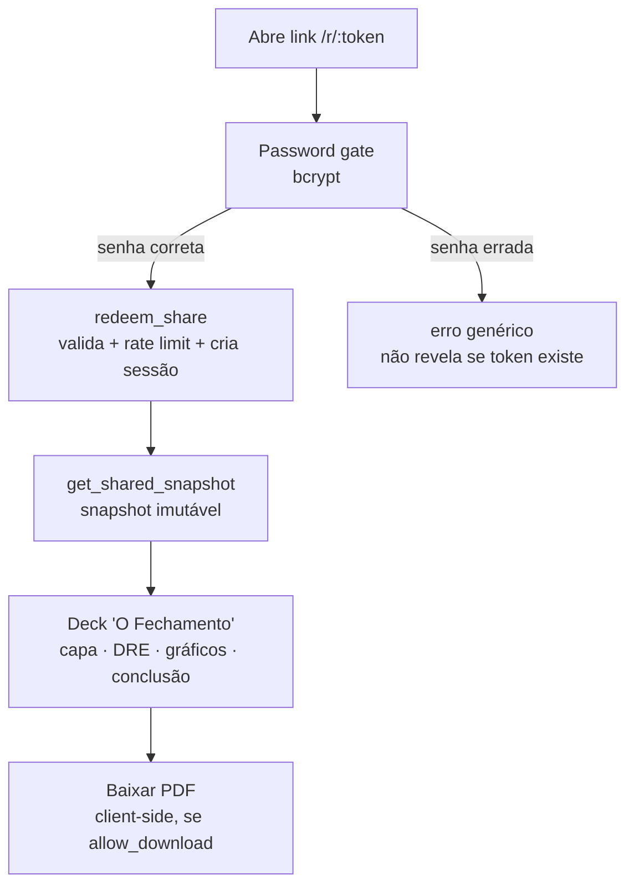

# 03 — Fluxos de usuário

Quatro fluxos importam: (1) a jornada da contadora, (2) o pipeline técnico de "1 botão", (3) a máquina de estados da auditoria e (4) o acesso do cliente externo. Roteiro real narrado em [`docs/ROTEIRO-JANAINA.md`](../ROTEIRO-JANAINA.md).

## 1. Jornada da contadora (interna)

Passo a passo:

1. **Clientes → Novo cliente** (nome + CNPJ).
2. **Auditorias → Nova auditoria** (cliente + período).
3. **Importar** ([`src/features/audits/import/import-page.tsx`](../../src/features/audits/import/import-page.tsx)): arrasta o arquivo na dropzone. A detecção automática mostra empresa/CNPJ/período + a linha de conferência ("Números conferidos" ou "DIVERGÊNCIA"). O mapeamento é adivinhado (`guessMapping`); ajuste manual num painel colapsável.
4. **Gerar dashboard** (1 botão) → dispara o pipeline técnico (abaixo).
5. Navega as 7 abas do workspace ([`workspace/audit-workspace.tsx`](../../src/features/audits/workspace/audit-workspace.tsx)): **Dashboard · Resumo · Dados · Inconsistências · Revisão · Relatório · Compartilhar**.
6. **Revisão**: justifica cada achado na aba Inconsistências e escreve a **Conclusão geral** (autosave — vai para o snapshot, o cliente e o PDF).
7. **Aprovar → Publicar → Compartilhar**: define senha e copia o link `/r/:token`.

## 2. Pipeline de "1 botão" (técnico)

Orquestrado por [`src/features/audits/data/use-ingest-pipeline.ts`](../../src/features/audits/data/use-ingest-pipeline.ts). O progresso aparece em linguagem humana; erros técnicos vão só ao console.

- **Parse acontece no browser** (Web Worker + SheetJS/PapaParse/pdf.js); o **arquivo original é imutável** no Storage.
- **Ingestão é idempotente** por `batch_seq` — reprocessar não duplica.
- **As regras rodam no banco** (`run_rules` RPC) — server-side, para serem confiáveis e auditáveis.

Por que parse no browser e regras no banco? Ver [06 — Arquitetura técnica](06-arquitetura-tecnica.md).

## 3. Máquina de estados da auditoria

Enum e guardas em [`supabase/migrations/`](../../supabase/migrations) (`enums.sql` + `rpcs.sql`). Toda transição passa pela RPC `transition_audit`; um trigger (`guard_audit_status`) impede mudar status fora dela.

Invariantes que sustentam a confiança:

- **Só o `owner` aprova e publica.**
- **Aprovar exige revisão completa** — zero itens `attention`/`divergence` em `pending`.
- **Publicar exige estado `approved`.**

Detalhe das transições e severidades em [04 — Regras de negócio](04-regras-de-negocio.md).

## 4. Cliente externo — `/r/:token`

Rota pública ([`src/routes/r/$token.tsx`](../../src/routes/r/$token.tsx)) que serve o deck **"O Fechamento"**. O `anon` do Supabase **não lê nenhuma tabela** — todo acesso passa por RPCs `SECURITY DEFINER`.

- **Senha** em `bcrypt`; **token** de 32 bytes (só o `sha256` é persistido).
- **Rate limit**: bloqueia após ≥5 falhas/15 min por token+IP ou ≥20/h por IP; IP sempre armazenado como `ip_hash` com pepper.
- **Sessão** com TTL de 60 min; acesso **somente leitura**.
- O deck só mostra o que a contadora liberou: itens `hidden_from_client` são excluídos do snapshot publicado.

Composição do deck: [`src/features/share/components/public-report.tsx`](../../src/features/share/components/public-report.tsx); narrativa em [`src/features/audits/analytics/insights.ts`](../../src/features/audits/analytics/insights.ts). Segurança detalhada em [05 — Como garantimos confiança](05-como-garantimos-confianca.md).
