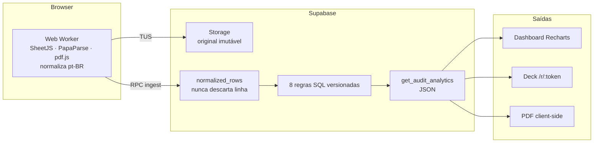

# 06 — Arquitetura técnica

Documentação para o desenvolvedor que vai continuar o projeto. Fonte profunda: [`docs/PRD.md`](../PRD.md) (§8 backend, §9 frontend). Mapa "onde mexer por papel": [`HANDOFF.md`](../../HANDOFF.md).

## Decisão central: parse no browser, regras no banco



**Por quê:** Edge Functions têm limite de ~2s de CPU por request — inviável para parse de XLSX de 20 MB. E as regras precisam rodar **server-side** para serem confiáveis e auditáveis (o cliente não pode influenciar o veredito). Então: o trabalho pesado de leitura acontece no navegador; a verdade contábil é calculada e guardada no banco.

## Stack

**Frontend / build**
- **React 19.2** + **Vite 8** (SPA, `type: module`) — não é Next.
- **TanStack Router 1.168** (file-based, auto code-splitting), **TanStack Query 5.99** (data/cache), **TanStack Table 8.21**.
- **Zustand 5.0** para auth ([`src/stores/auth-store.ts`](../../src/stores/auth-store.ts)); **TypeScript ~6.0**.

**UI**
- **shadcn/ui** (estilo new-york) sobre **Radix** + **Tailwind v4.2**; **Recharts 3.9**, **Sonner**, **cmdk**, **Lucide**.
- Direção visual **Firecrawl** (laranja `#E97318`). Tokens em [`src/styles/theme.css`](../../src/styles/theme.css). Régua de craft: [`docs/design/CRAFT.md`](../design/CRAFT.md).

**Processamento (browser, Web Worker)** — [`src/workers/`](../../src/workers)
- **SheetJS/xlsx 0.18**, **PapaParse 5.4** (CSV), **pdfjs-dist 6.1** (DRE em PDF), **tus-js-client 4.3** (upload resumável).

**Backend — Supabase** — [`supabase/`](../../supabase)
- `@supabase/supabase-js 2.47`; cliente único em [`src/lib/supabase.ts`](../../src/lib/supabase.ts) (claims de tenant/role lidos de `app_metadata` no JWT).
- Postgres + Auth + Storage + Edge Functions (Deno) + Realtime.

**Saídas** — Dashboard (Recharts), deck público, **PDF client-side** (`@react-pdf/renderer 4.1`). Forms com `react-hook-form` + `zod`.

## Organização do `src/`

```
src/
├─ routes/       TanStack Router file-based
│                _authenticated/* (guarda de auth) + r/$token.tsx (público) + (auth)/*
├─ features/     código por domínio (cada feature tem data/ com queries/mutations/schema Zod)
│  ├─ audits/    o coração: analytics/ (view-models + charts) · workspace/ (abas + panels)
│  │             · import/ (fluxo 1 botão) · data/use-ingest-pipeline.ts
│  ├─ share/     deck público "O Fechamento" (public-report, deck/, password-gate)
│  ├─ clients/ · team/ · billing/ · overview/ · auth/ · settings/ · errors/
├─ components/   layout/ (sidebar, header, nav) + ui/ (shadcn, alguns com RTL)
├─ workers/      parse.worker.ts + normalize.ts + extractors/
├─ lib/          supabase.ts · permissions.ts (UI) · strings.ts (textos PT-BR)
├─ stores/       auth-store.ts (zustand)
└─ styles/       theme.css (tokens)
```

Rotas internas: `/` (início), `/clients`, `/audits`, `/audits/$auditId` (workspace com 7 abas via `?tab=`), `/audits/$auditId/import`, `/team`, `/billing`, `/settings`. Rota pública: `/r/$token`.

## Backend Supabase

**Migrations = a verdade** — [`supabase/migrations/`](../../supabase/migrations), 15 arquivos ordenados:

| Migration | Conteúdo |
|---|---|
| `…000100_extensions` → `…000200_enums` | extensões e enums de domínio |
| `…000300_core_tables` | escritorios, profiles, clientes, mappings, audits, files, comments |
| `…000400_pipeline_tables` | normalized_rows, ingest_batches, rules, rule_runs, rule_results |
| `…000500_share_billing_tables` | published_snapshots (imutável), shares, sessões, billing |
| `…000600_audit_events` | trilha append-only |
| `…000700_rls` | RLS multi-tenant |
| `…000800_rule_functions_v1` | as 8 regras (`app.rule_*_v1`) |
| `…000900_rpcs` | 12 RPCs (ver abaixo) |
| `…001000_storage` · `…001100_realtime` · `…001200_seed_pilot` | storage, realtime, escritório piloto |
| `…001300_analytics` | `get_audit_analytics` (JSON do dashboard/deck) |
| `…002000_trust_telemetry` | nome do escritório no snapshot |
| `…150000_classificacao_codigo` | **migração 7** — classificação por código + R001/R002 cientes de documento |

**12 RPCs** ([`20260711000900_rpcs.sql`](../../supabase/migrations/20260711000900_rpcs.sql)): `register_file`, `save_mapping`, `ingest_rows`, `finalize_file`, `run_rules`, `run_single_rule`, `transition_audit`, `publish_audit`, `create_share`, `revoke_share`, `redeem_share`, `get_shared_snapshot`.

**Segurança** — RLS multi-tenant por `escritorio_id` (claim no JWT); `anon` não lê nenhuma tabela; o link público só passa por RPCs `SECURITY DEFINER` (`redeem_share`/`get_shared_snapshot`) com bcrypt + rate limit + snapshot imutável. Detalhe em [05 — Como garantimos confiança](05-como-garantimos-confianca.md).

**Edge Functions (Deno)** — [`supabase/functions/`](../../supabase/functions): `create-checkout-session`, `customer-portal`, `invite-user`, `stripe-webhook`. **Escritas mas ainda não deployadas** (o trial de 90 dias cobre o piloto). Ver [07 — Rodando e deployando](07-rodando-e-deployando.md).

## Convenções (siga ao mexer)

- **Textos de UI em [`src/lib/strings.ts`](../../src/lib/strings.ts)** — componente não tem literal.
- **Permissões de UI em [`src/lib/permissions.ts`](../../src/lib/permissions.ts)** — segurança real é RLS.
- **TanStack Query**: `queryOptions` em `data/queries.ts`; mutations com invalidation.
- **Regras versionadas**: mudou? cria `_v2`, nunca edita a v1.
- **Design tokens**: única extensão permitida é `--success`/`--warning`/`--info`.

Continue em: [07 — Rodando e deployando](07-rodando-e-deployando.md) · [08 — Testes e qualidade](08-testes-e-qualidade.md).
