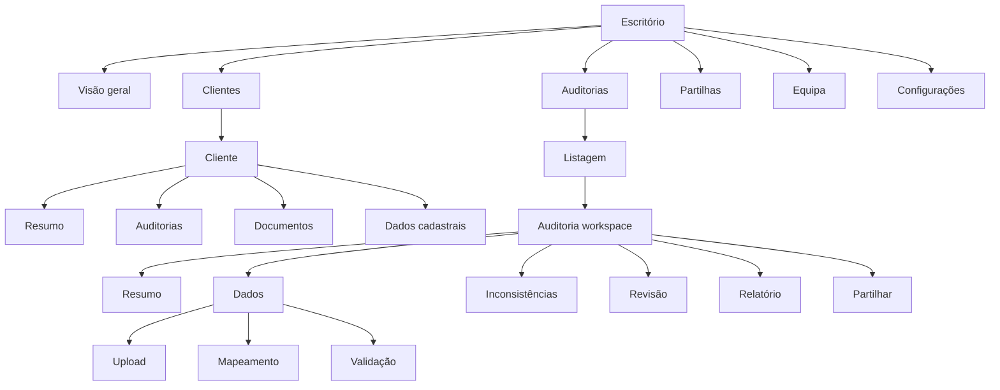

# Padrões de design e UX em produtos financeiros e implicações para a Plataforma de Auditoria Contabil Visual

## Resumo executivo

A pesquisa aponta para uma conclusão muito clara: o melhor caminho para o vosso MVP **não** é copiar um “dashboard financeiro” genérico, mas sim combinar dois modelos de produto que se complementam bem. Do lado dos produtos financeiros observados no ecossistema do Mobbin, o padrão dominante é um conjunto de fluxos altamente guiados, com forte controlo de estados, revisão, confirmação e confiança visual. Do lado do Airtable, o ganho está na organização do trabalho em **contexto persistente**: um objecto principal, múltiplas vistas, barra de ferramentas local, detalhe lateral e colaboração contínua. A arquitectura que já tinham discutido — **auditoria como workspace**, com abas, barra de ferramentas e painel lateral — está, portanto, na direcção certa; o que falta é torná-la mais rigorosa, mais operacional e mais adequada ao quotidiano do escritório. citeturn8view2turn9view1turn31search2turn35search4

O Mobbin descreve o Finance+ como um acervo de **50 apps exclusivos**, distribuídos por **12+ categorias** financeiras, com pesquisa por **app, flow ou pattern**, e cita explicitamente fluxos nucleares como **onboarding para neobancos** e **KYC para exchanges de cripto**. Também afirma que a sua biblioteca global já ultrapassa **1.428 apps**, **621.500+ ecrãs** e **323.900 flows**, com pesquisa por **screens, UI elements, flows e text in screenshots**. Isto é relevante porque mostra que, nos melhores produtos financeiros, os fluxos mais valiosos não são as homepages; são os circuitos de operação: entrada de dados, validação, revisão, decisão e partilha. citeturn5view1turn8view2turn9view1

Ao mesmo tempo, o vosso material interno já segue um padrão repetível: **sumário executivo**, **composição das despesas**, **rankings**, **leitura gerencial por empresa**, **pontos críticos** e **plano de acção**. Isso significa que o MVP deve ser construído menos como um “painel de BI” e mais como uma **fábrica de análise auditável**, com uma área de trabalho persistente por auditoria e duas saídas principais: visão técnica para o escritório e visão simplificada para a cliente final. fileciteturn0file1 fileciteturn0file0 fileciteturn0file3

Em termos de prioridades, eu recomendaria adoptar **já** cinco padrões: **sidebar global**, **workspace por auditoria**, **abas locais**, **barra de ferramentas sobre a tabela principal** e **painel lateral de detalhe/revisão**. Em contrapartida, deixaria **para depois** a personalização livre de vistas, automações avançadas, comentários complexos em thread, IA conversacional e qualquer tentativa de replicar a flexibilidade total do Airtable. O objectivo do MVP é reduzir tempo e ambiguidade para a proprietária e para a equipa, não criar uma plataforma genérica. citeturn35search4turn35search9turn35search2

## Método e limites da investigação

A base principal desta análise foi o ecossistema público do Mobbin, com especial atenção à página **Finance+**, que explicita o seu foco em fluxos financeiros “difíceis de aceder” e enumera produtos e categorias relevantes, e à página pública do Mobbin, que descreve a estrutura da biblioteca e os tipos de pesquisa disponíveis. Usei também referências públicas sobre o modelo conceptual do Airtable e referências gerais de usabilidade, acessibilidade e design de sistemas de interface. citeturn5view1turn8view2turn9view1turn31search2turn35search4turn27search2turn27search0

Há, no entanto, uma limitação importante: a **URL específica do Mobbin para o Airtable** que partilhaste antes não pôde ser capturada nesta sessão, por falha de fetch/cache. Por isso, onde a tela exacta do Mobbin não estava disponível, descrevo o padrão com base em metadados públicos do Mobbin, no posicionamento do Finance+, em padrões observáveis destes produtos e em princípios clássicos de usabilidade. Isto torna a análise suficientemente útil para decisão de produto, mas não deve ser lida como uma auditoria pixel-a-pixel das telas pagas do Mobbin. citeturn2view0turn8view2turn9view1

Também considerei o vosso contexto funcional. Os relatórios actuais mostram que o trabalho do escritório não termina em “mostrar números”: ele inclui consolidação, leitura gerencial, diagnóstico, ranking, criticidade e plano de acção. Logo, os padrões mais relevantes não são os de apps de investimento para consumidores; são os de ferramentas financeiras e operacionais com **revisão, filtragem, explicação, priorização e handoff**. fileciteturn0file1 fileciteturn0file0 fileciteturn0file5

## Catálogo de telas e fluxos relevantes

O Mobbin Finance+ não expõe publicamente todas as telas, mas expõe algo suficiente para reconstruir o catálogo de fluxos relevantes: pesquisa por **app, flow ou pattern**; foco em fluxos financeiros “core”, e não apenas onboarding genérico; referência explícita a **onboarding de neobancos**, **KYC para exchanges**, apps de **banking, payments, crypto, business accounts, prediction markets, lending, investing, insurance** e apps como **Bank of America, Capital One, Chase UK, Current, PayPal Business, TurboTax, Wealthfront, Webull, eToro, Betterment e Rocket Mortgage**. Isso sugere, com elevado grau de confiança, que o corpus de referência inclui ao menos seis famílias de ecrãs úteis para o vosso produto. citeturn8view2turn9view1

A primeira família é a de **entrada e validação guiada**. Em finanças, o utilizador raramente despeja dados num vazio; ele é conduzido por etapas com indicação do que falta, do estado actual e do próximo passo. Para o vosso caso, isso aponta directamente para um fluxo de **upload → identificação → mapeamento → validação → processamento**, em vez de um simples “carregar ficheiro e ir para o dashboard”. Este desenho também respeita heurísticas clássicas de visibilidade do estado do sistema, prevenção de erro e reconhecimento em vez de recordação. citeturn8view2turn35search4turn35search9

A segunda família é a de **workspace operacional com contexto persistente**. Produtos financeiros mais sofisticados tendem a manter o utilizador dentro de um objecto de trabalho — conta, empresa, carteira, declaração, pedido, ciclo de aprovação — e não a fazê-lo saltar entre páginas administrativas sem contexto. É precisamente aqui que o vosso princípio de “auditoria como workspace” fica validado. O Airtable, enquanto produto híbrido entre folha de cálculo e base de dados, tornou-se conhecido por organizar trabalho em registos, vistas, ordenação, colaboração e publicação de vistas; essa lógica adapta-se muito bem a uma auditoria como unidade de trabalho contínua. citeturn31search2turn16search3turn35search2

A terceira família é a de **dashboards orientados por excepção**. Em produtos financeiros maduros, o dashboard raramente tenta mostrar tudo; ele responde primeiro a perguntas como “o que exige atenção?”, “o que mudou?”, “o que está pendente?”, “quem decide?” e “qual o impacto?”. Isto coincide com o vosso material, que enfatiza concentração de despesas, empresas críticas, maiores contas, pressão percentual, resultado por empresa e plano de acção. O dashboard do escritório deve herdar esta lógica: menos cartões decorativos, mais estado operacional e excepções. fileciteturn0file1 fileciteturn0file3 fileciteturn0file5

A quarta família é a de **tabelas densas com ferramentas locais**. O próprio Mobbin destaca UI elements como **sidebar, toast, progress indicator, dialog e tab**; em produtos financeiros, estes elementos não vivem isolados, mas junto a tabelas ou listas densas onde o utilizador procura, filtra, agrupa, ordena, revê e toma decisões. Para o vosso produto, a tabela de inconsistências é o núcleo da experiência do escritório. Isso exige uma barra de ferramentas robusta por cima da grelha, e não filtros dispersos em várias zonas da página. citeturn5view1turn35search4turn35search9

A quinta família é a de **revisão e aprovação**. O Mobbin Finance+ insiste precisamente na utilidade de ver os fluxos que estão “behind paywalls and approvals”; isto é particularmente relevante porque o vosso caso também tem um ponto de transição sensível: o contador revê, decide o que fica visível e só depois publica para a cliente. Portanto, revisão não é um submenu menor: é um passo central do workflow. O sistema deve tornar pendências, atribuições, comentários curtos e decisão final imediatamente visíveis. citeturn8view2turn9view1turn35search4

A sexta família é a de **partilha controlada**. O Airtable é conhecido por permitir publicação de vistas, e no ecossistema financeiro o acesso parcial e controlado é recorrente. No vosso MVP, o equivalente é a auditoria partilhada por link com palavra-passe, revogável e opcionalmente com expiração. A forma ideal de o desenhar não é como “exportar e esquecer”, mas como uma área de publicação com estado: activo, expirado, revogado, visualizado, última visita. citeturn31search2turn35search4

### Mapa dos fluxos mais úteis a reaproveitar

| Fluxo de referência | Como aparece em produtos financeiros | Tradução para o MVP de auditoria |
|---|---|---|
| Entrada guiada | Onboarding, KYC, verificação passo a passo | Upload, leitura, mapeamento, validação |
| Workspace contextual | Conta, carteira, pedido, declaração | Auditoria como espaço de trabalho |
| Dashboard por excepção | Alertas, risco, pendências, desvios | Divergências, atenções, revisões pendentes |
| Tabela operacional | Transacções, aprovações, relatórios | Inconsistências, linhas rejeitadas, regras |
| Revisão / aprovação | Aprovar, rejeitar, pedir mais informação | Rever, justificar, ocultar, publicar |
| Partilha controlada | Vistas partilhadas, estados de acesso | Link com palavra-passe e expiração |

A interpretação acima é uma inferência de desenho ancorada no catálogo público do Mobbin Finance+, nos padrões gerais de produtos financeiros e no vosso fluxo real de trabalho. citeturn8view2turn9view1turn35search4

## Padrões de navegação, hierarquia visual e componentes reutilizáveis

O padrão de navegação mais consistente entre ferramentas complexas é a combinação de **navegação global + contexto local + modo de visualização**. No vosso caso, isso deve tornar-se explícito. A navegação global fica na sidebar fixa do template; o contexto local passa a ser a auditoria actual; e o modo de visualização é resolvido por abas e vistas guardadas. Este arranjo satisfaz consistência, reconhecimento, controlo do utilizador e redução de carga cognitiva. citeturn5view1turn35search4turn35search9

A hierarquia visual recomendada para cada ecrã operacional é simples e repetível. Em primeiro lugar, um **cabeçalho contextual** com nome da auditoria, cliente, período, responsável e estado. Em segundo lugar, uma **faixa de próxima acção** com CTA principal. Em terceiro lugar, um pequeno conjunto de **KPIs de orientação**, nunca mais de quatro ou cinco. Em quarto lugar, a **barra de ferramentas local**. Só depois entra a superfície principal: tabela, lista agrupada, visualização de revisão ou pré-visualização do relatório. Este tipo de hierarquia está alinhado com princípios de legibilidade, controlo de atenção e visibilidade do estado. citeturn35search4turn35search9turn35search2

Em termos de componentes, há um conjunto que se destaca de forma quase universal e que o Mobbin identifica de modo explícito na sua biblioteca: **sidebar, tabs, progress indicator, dialog, toast**, além de pesquisa e flows estruturados. Destes, para o vosso caso, o mais importante é perceber função e dose. A **sidebar** serve para trocar de módulo; as **tabs** servem para trocar de modo dentro da auditoria; o **progress indicator** serve para o fluxo de importação; o **toast** serve apenas para confirmações leves; e o **dialog** deve ficar reservado a exclusões ou confirmações de risco, não ao trabalho principal. citeturn5view1

As microinteracções mais úteis são discretas. Produtos financeiros maduros evitam animação excessiva, mas usam feedback rápido e contextual: guardado automático, badge de estado, transição de loading para sucesso, skeletons em listas, mudança clara de estado após revisão, indicação do número de filtros activos e contadores de resultados. Isso conversa directamente com a heurística de visibilidade do estado do sistema e com acessibilidade baseada em feedback claro. citeturn35search4turn27search2turn27search0

Há ainda uma distinção importante entre o que o escritório precisa e o que a proprietária precisa. A equipa operacional beneficia de densidade informativa e rapidez de revisão; a proprietária beneficia de **priorização**, **estado do pipeline**, **carteira de auditorias**, **gargalos da equipa** e **decisões pendentes**. Por isso, a home da proprietária não deve começar com muitos gráficos de negócio; deve começar com uma visão do trabalho: o que está atrasado, o que aguarda revisão, o que está pronto a publicar, o que foi visto pela cliente. Esta recomendação não vem de um único padrão visual, mas da combinação entre produtos de operação e as vossas próprias entregas gerenciais. fileciteturn0file1 fileciteturn0file3 citeturn35search4

### Tabela comparativa de padrões prioritários

| Padrão | Descrição | Benefício | Risco ou contraindicação | Prioridade |
|---|---|---|---|---|
| Sidebar global fixa | Módulos do escritório sempre acessíveis no mesmo lugar | Estabilidade mental e navegação previsível | Sidebar demasiado longa ou com rotas internas irrelevantes | Alta |
| Auditoria como workspace | Cada auditoria tem cabeçalho, estado e superfície própria | Reduz saltos entre páginas e preserva contexto | Se mal desenhada, pode parecer “produto dentro do produto” | Alta |
| Abas locais | Resumo, Dados, Inconsistências, Revisão, Relatório, Partilha | Separa modos sem fragmentar demais | Tabs em excesso tornam-se pouco claras | Alta |
| Barra de ferramentas sobre a tabela | Pesquisa, filtro, ordenação, agrupamento, colunas | Acelera revisão e reduz procura visual | Excesso de controlos no topo pode intimidar iniciantes | Alta |
| Painel lateral de detalhe | Abre detalhe sem sair da lista | Revisão muito mais rápida | Não serve para fluxos longos de edição | Alta |
| Vistas guardadas predefinidas | “Todas”, “Divergências”, “Pendentes”, “Atribuídas a mim” | Apoia diferentes papéis da equipa | Personalização livre cedo demais gera confusão | Média-alta |
| Stepper de importação | Upload, mapeamento, validação, processamento | Dá segurança e reduz falhas de orientação | Se houver passos demais, pode parecer burocrático | Alta |
| Dashboard por excepção | Cartões e listas com foco em desvios e pendências | Melhora priorização da proprietária | Se esconder demasiado, reduz confiança analítica | Alta |
| Partilha com estado | Link, palavra-passe, validade, acessos, revogação | Reforça segurança e governance | Fluxo excessivamente técnico para o cliente final | Média-alta |
| Comentário e justificação curtos | Notas rápidas item a item | Regista decisão sem abrir editor pesado | Threads longas no MVP criam manutenção desnecessária | Média |
| Publicação em modo leitura | Vista simplificada do cliente | Evita jargão técnico e protege dados | Se simplificar em demasia, pode parecer superficial | Alta |
| Personalização livre de campos/vistas | Utilizador molda tudo | Flexibilidade futura | Overengineering, inconsistência e suporte caro | Baixa para MVP |

A priorização decorre da combinação entre padrões observados em produtos financeiros, princípios de usabilidade clássicos e o vosso fluxo real de escritório. citeturn8view2turn35search4turn35search9turn35search2

## Comparação com Airtable e com a arquitectura proposta

A comparação com o Airtable é muito útil, mas deve ser precisa. O Airtable funciona bem porque trata o trabalho como combinação de **registos, tipos de campo, ordenação, colaboração e publicação de vistas**; ele não força o utilizador a mudar de página para cada pequena decisão. Para o vosso produto, isto confirma a bondade de quatro escolhas: **workspace persistente**, **abas locais**, **vista tabular como centro da operação** e **separação entre objecto e visualização do objecto**. citeturn31search2turn16search3

Ao mesmo tempo, a vossa plataforma **não deve tentar tornar-se um Airtable financeiro**. Há uma diferença essencial: no Airtable, a flexibilidade estrutural é quase um fim em si mesma; na auditoria contabilística, o objectivo é produzir uma análise determinística, rastreável e compreensível. Isso significa que o produto deve reaproveitar a lógica de contexto, vistas e filtragem, mas evitar cedo demais características como criação livre de campos, fórmulas abertas, múltiplas vistas arbitrárias por utilizador e alteração livre da estrutura dos dados. A heurística aqui é consistência e prevenção de erro: demasiada liberdade cedo demais corrói confiança. citeturn31search2turn35search4turn35search9

A arquitectura que já tinhas proposto — **auditoria como workspace, abas, barra de ferramentas, painel lateral** — é, em termos de UX, mais forte do que um CRUD administrativo clássico. O que falta é afinar a gramática da interface: o workspace deve ter um cabeçalho persistente; as tabs devem representar **modos de trabalho** e não subpáginas arbitrárias; a barra de ferramentas deve ficar sempre colada à superfície principal; e o painel lateral deve absorver o detalhe de linha, a revisão rápida e a atribuição. Sem isso, a ideia geral é boa, mas a execução corre o risco de regressar ao padrão “paginação de backoffice”. citeturn35search4turn35search2

Também convém aprender com os limites dos produtos financeiros mais visuais. Design languages com muita profundidade, translucidez ou efeitos “glass” podem funcionar bem em interfaces de consumo, mas em ambientes operacionais o custo costuma ser perda de contraste, ruído e fadiga. Até a própria recepção das linguagens visuais mais recentes da Apple mostrou que um visual muito expressivo pode sacrificar clareza se entrar em choque com densidade informativa e controlos frequentes. Para uma plataforma de auditoria, clareza e contraste devem prevalecer sobre espectáculo visual. citeturn24news0turn24news4turn24search3

## Recomendações concretas para o MVP

A primeira recomendação é estrutural: **adoptar já a auditoria como unidade central do produto**. Isto significa que, depois da lista de auditorias, o utilizador deve entrar num espaço com cabeçalho persistente, não numa sequência de páginas avulsas. Para a equipa, isto reduz o custo de contexto; para a proprietária, facilita a leitura do estado e da responsabilidade sobre cada auditoria. É a decisão com maior impacto no fluxo do escritório. citeturn35search4turn35search9

A segunda recomendação é ergonómica: **fazer da tabela de inconsistências o centro da operação**. O vosso trabalho actual já assenta em ranking, desvios, materialidade e grupos de despesa; por isso, o dashboard deve conduzir rapidamente para a grelha resolutiva, e não competir com ela. A barra superior da grelha deve ter pesquisa, filtros, ordenação, agrupamento e controlo de colunas, com contagem clara de resultados e filtros activos. fileciteturn0file1 fileciteturn0file5 citeturn35search4

A terceira recomendação é processual: **introduzir um fluxo de importação em etapas visíveis**. Produtos financeiros de alta confiança não pedem ao utilizador que acredite “que tudo correu bem”; mostram-lhe o percurso. No MVP, bastam cinco passos: enviar ficheiro, identificar colunas, mapear, validar, processar. Cada passo deve mostrar o que foi reconhecido, o que ficou em falta e o que impede o avanço, sempre com linguagem simples. Isto é especialmente importante porque o vosso princípio é nunca quebrar o fluxo por erro parcial. citeturn8view2turn35search4turn35search9

A quarta recomendação é colaborativa: **criar vistas guardadas predefinidas por papel**, mas não permitir personalização total no MVP. As vistas mínimas deveriam ser “Todas”, “Divergências”, “Atenções”, “Pendentes de revisão”, “Atribuídas a mim” e “Ocultas da cliente”. Isto dá à equipa foco operacional sem cair no overengineering de um construtor genérico de vistas. citeturn31search2turn35search4

A quinta recomendação é decisiva para a proprietária: **a home deve começar pela operação, não pela estética**. Em vez de muitos cartões de KPI logo à entrada, a primeira dobra deve mostrar “minha fila”, “auditorias a aguardar revisão”, “atrasadas”, “prontas a partilhar” e “visualizadas pela cliente”. Os gráficos entram depois, como segunda camada. Para quem gere escritório e equipa, a principal necessidade é saber onde actuar agora. fileciteturn0file1 citeturn35search4turn35search2

O que deve ser adiado? Eu adiaria a criação livre de vistas, comparações muito avançadas entre períodos, comments complexos em thread, automações configuráveis, dashboards altamente personalizáveis e qualquer camada conversacional tipo “pergunta aos teus dados”. Nada disto é necessário para validar o produto com um escritório piloto; pelo contrário, introduz ambiguidade, custo cognitivo e custo de manutenção. citeturn35search4turn35search9

### O que adoptar já e o que deixar para depois

| Adoptar imediatamente | Adiar |
|---|---|
| Workspace por auditoria | Vistas totalmente personalizáveis |
| Tabs locais por modo de trabalho | Fórmulas e campos livres |
| Stepper de importação | Automação avançada |
| Tabela com toolbar forte | Comentários em thread ricos |
| Painel lateral de detalhe | IA conversacional |
| Estado e próxima acção visíveis | Benchmarking multi-escritório |
| Página de partilha controlada | Configuração avançada de relatórios |

## Wireframes simples e mapeamento para o template

A navegação recomendada pode ser pensada assim:



Esta estrutura mantém a sidebar do template para a navegação global e desloca a complexidade para o interior do workspace, onde faz mais sentido operacionalmente. citeturn5view1turn35search4

O fluxo mais importante do produto deve ser assim:


Este diagrama é mais adequado do que um CRUD puro porque respeita o carácter sequencial, auditável e colaborativo da actividade. citeturn8view2turn35search4turn35search9

### Wireframe da listagem de auditorias

```text
┌──────────────────────────────────────────────────────────────────────┐
│ Auditorias                                              [Nova]      │
│ Procurar…              Estado ▾   Responsável ▾   Período ▾         │
├──────────────────────────────────────────────────────────────────────┤
│ Cliente            Período      Estado          Pendências   Ações   │
│ Grupo X            Jan/2026     Em revisão      12           Ver     │
│ Empresa Y          Fev/2026     Mapeamento      3            Ver     │
│ Empresa Z          Mar/2026     Partilhada      0            Ver     │
└──────────────────────────────────────────────────────────────────────┘
```

### Wireframe do workspace da auditoria

```text
┌────────────────────────────────────────────────────────────────────────────┐
│ ← Auditorias   Grupo X · Auditoria Jan/2026         [Pronta a rever]      │
│ Responsável: Ana   Última actualização: há 8 min    Próxima acção: Rever  │
├────────────────────────────────────────────────────────────────────────────┤
│ Resumo | Dados | Inconsistências | Revisão | Relatório | Partilhar         │
├────────────────────────────────────────────────────────────────────────────┤
│ Alertas 24   Divergências 8   Linhas ignoradas 31   Filtros activos 2      │
├────────────────────────────────────────────────────────────────────────────┤
│ Procurar…  Estado ▾ Regra ▾ Responsável ▾ Agrupar ▾ Ordenar ▾ Colunas ▾    │
├───────────────────────────────────────────────┬────────────────────────────┤
│ TABELA DE INCONSISTÊNCIAS                     │ PAINEL LATERAL             │
│ linha 284 | Débito ≠ Crédito | 450€ | Ana     │ Regra                     │
│ linha 771 | Data inválida     | —    | Rui    │ Origem                    │
│ linha 982 | Conta ausente     | —    | Ana    │ Justificação              │
│ ...                                           │ Visível à cliente? [ ]     │
│                                               │ [Marcar revisto]           │
└───────────────────────────────────────────────┴────────────────────────────┘
```

### Wireframe da experiência da cliente

```text
┌──────────────────────────────────────────────────────────────────────┐
│ Auditoria de Janeiro 2026 · Grupo X                                 │
│ Situação geral: Atenção                                              │
├──────────────────────────────────────────────────────────────────────┤
│ Receita │ Despesa │ Resultado │ Itens revistos pelo escritório      │
├──────────────────────────────────────────────────────────────────────┤
│ Principais pontos de atenção                                         │
│ • Despesa/receita acima do esperado                                  │
│ • Concentração de custos em pessoal                                  │
│ • 3 empresas com pressão percentual elevada                          │
├──────────────────────────────────────────────────────────────────────┤
│ Gráficos simples                                                     │
│ Resumo do escritório                                                 │
│ [Descarregar PDF]                                                    │
└──────────────────────────────────────────────────────────────────────┘
```

### Mapeamento técnico mínimo para React + shadcn/ui + Tailwind + TanStack

No template `satnaing/shadcn-admin`, a sidebar global deve continuar a ser o eixo principal de navegação, usando a estrutura já existente do layout. Dentro do workspace da auditoria, as **tabs** podem ser feitas com `Tabs` do shadcn/ui; o **painel lateral** com `Sheet`; os **badges de estado** com `Badge`; a **faixa de próxima acção** com `Alert` ou `Card`; a **toolbar** com `Input`, `Select`, `DropdownMenu` e `Button`; e a tabela central com `TanStack Table` sobre o markup de `Table` do shadcn/ui. Isto permite manter consistência visual com o template, sem inventar um outro design system.

Com `TanStack Table`, vale a pena começar apenas com o essencial: `globalFilter`, `columnFilters`, `sorting`, `columnVisibility` e, se necessário, agrupamento numa fase seguinte. Com `TanStack Query`, o ganho principal está em separar bem consultas de listagem, detalhe do painel lateral, estados de revisão e métricas de dashboard, com invalidação pontual após acções do utilizador. Com Tailwind, a prioridade é layout e hierarquia, não estética nova: `sticky top-*` para toolbar, `grid` simples para blocos de KPI, e larguras previsíveis para o `Sheet` e para os painéis principais.

## Acessibilidade, performance e critérios de qualidade

Em acessibilidade, os requisitos mínimos para este MVP são menos “nice to have” do que parecem. A WCAG 2.2 é uma recomendação W3C e acrescenta critérios importantes como **Focus Not Obscured**, **Focus Appearance**, **Dragging Movements** e **Target Size (Minimum)**. Para uma aplicação de revisão intensiva com muitas linhas, filtros e painéis laterais, isto traduz-se em foco visível, ordem de tabulação previsível, interacções completas por teclado e áreas clicáveis confortáveis. citeturn27search2turn27search4

O WAI-ARIA permanece relevante, mas com uma regra prudente: usar primeiro elementos HTML nativos e só depois acrescentar semântica ARIA quando necessário. Isto é especialmente importante em tabelas, tabs, menus de colunas, toasts e painéis laterais, onde a tentação de construir tudo de forma “custom” pode degradar gravemente a experiência com leitores de ecrã. citeturn27search0

Há também padrões específicos de interface a respeitar. Labels e cabeçalhos devem ser claros e consistentes; os estados têm de ser textuais e não apenas cromáticos; a contagem de resultados e filtros deve ser explícita; os erros devem surgir junto do ponto de acção e em linguagem humana; e a publicação da auditoria para a cliente deve gerar uma versão limpa, legível e sem ruído técnico. Tudo isto se alinha com as heurísticas de visibilidade do estado, consistência, prevenção de erro e reconhecimento em vez de recordação. citeturn35search4turn35search9

Em performance, o principal risco do vosso produto não é tanto o rendering de gráficos, mas sim **tabelas densas**, listas extensas, múltiplos pedidos de dados e documentos pesados. Por isso, o MVP deve priorizar paginação ou virtualização onde necessário, fetch sob demanda para detalhes laterais, carregamento diferido de secções não críticas e gráficos simples com payload reduzido. Em termos gerais de web performance, lazy loading continua a ser uma técnica sólida para adiar recursos não necessários no primeiro render; e, no caso de imagens web, formatos modernos como WebP e AVIF mostraram ganhos médios de carregamento face a JPEG em estudo académico recente. citeturn28search1turn28academia3

O critério de qualidade mais importante, no entanto, é o da **confiança operacional**. Num produto deste tipo, responder em 200 ms com um estado pouco claro é pior do que responder em 700 ms com feedback explícito. A percepção de controlo depende de mensagens de progresso, skeletons previsíveis, estados vazios explicativos e transições que nunca deixem o utilizador a pensar “isto guardou?” ou “isto publicou?”. Esse é exactamente o território das heurísticas clássicas e dos bons produtos financeiros. citeturn35search4turn35search9

## Síntese final

Se eu tivesse de resumir a recomendação numa frase, seria esta: **adoptem a disciplina operacional dos produtos financeiros e a organização contextual do Airtable, mas mantenham a rigidez e a clareza próprias de uma ferramenta de auditoria**. O vosso produto não precisa de parecer “moderno” no sentido cosmético; precisa de parecer fiável, orientado a decisão e fácil de operar por uma dona de escritório e pela sua equipa. citeturn8view2turn31search2turn35search4

O Mobbin Finance+ reforça que os melhores fluxos financeiros vivem em contextos difíceis, com gates, validação, aprovação e confiança. Os vossos materiais internos mostram que a entrega real do escritório já é estruturada em síntese, diagnóstico, ranking, criticidade e plano de acção. A convergência natural desses dois mundos é um MVP com **auditoria como workspace**, **fluxo guiado de importação**, **tabela operacional com toolbar**, **revisão assistida em painel lateral** e **publicação controlada para a cliente**. Isso é o que eu adoptaria imediatamente. citeturn8view2turn9view1 fileciteturn0file1 fileciteturn0file0

### Referências públicas principais usadas nesta análise

- Mobbin homepage e estrutura da biblioteca. citeturn5view1  
- Mobbin Finance+ landing page e catálogo público de apps/categorias/flows. citeturn8view2turn9view1  
- URL específica do Mobbin para o Airtable fornecida na conversa, não capturável nesta sessão. citeturn2view0  
- Descrição pública do modelo do Airtable como híbrido de spreadsheet/database com colaboração, ordenação e publicação de vistas. citeturn31search2turn16search3  
- Heurísticas de Nielsen e avaliação heurística. citeturn35search4turn35search9  
- ISO 9241 como referência de ergonomia da interacção homem-sistema. citeturn35search2  
- WCAG 2.2 e WAI-ARIA como base de acessibilidade. citeturn27search2turn27search0  
- Material Design e ecossistema Apple como referências complementares de sistemas visuais. citeturn22search0turn24search3turn24search8  
- Materiais internos do vosso escritório, baseados em análises gerenciais e estratégicas já existentes. fileciteturn0file1 fileciteturn0file0 fileciteturn0file3 fileciteturn0file5